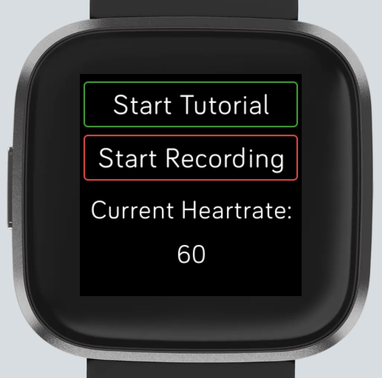
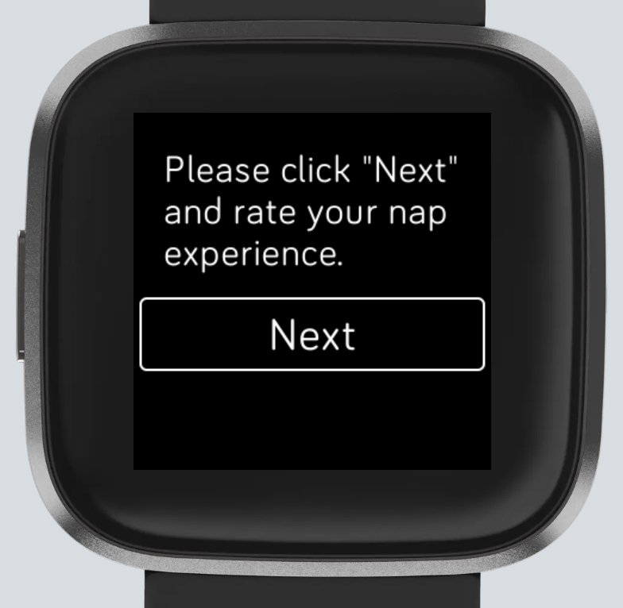
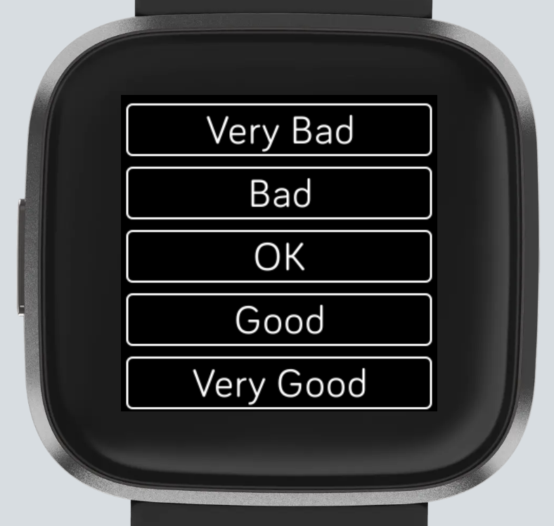
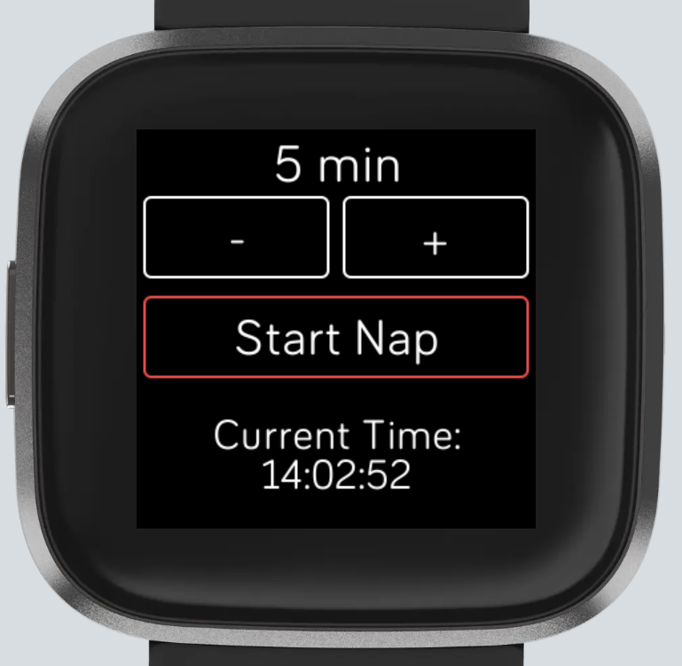
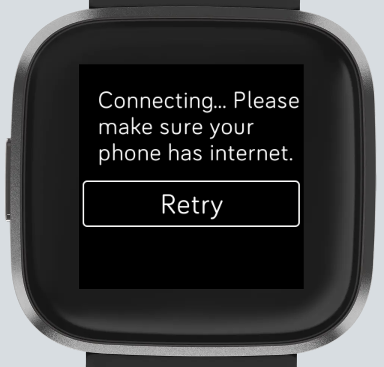
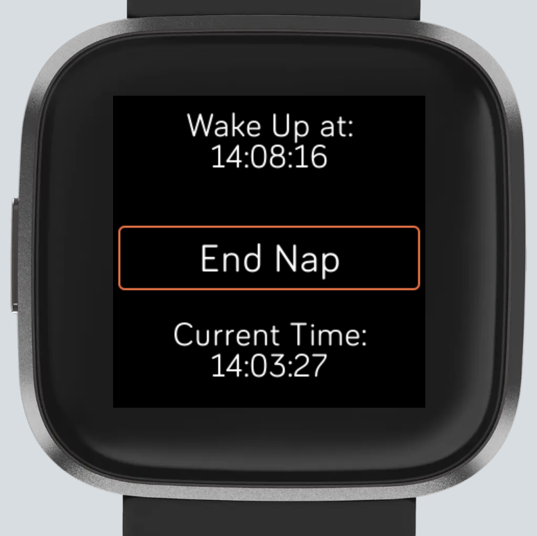
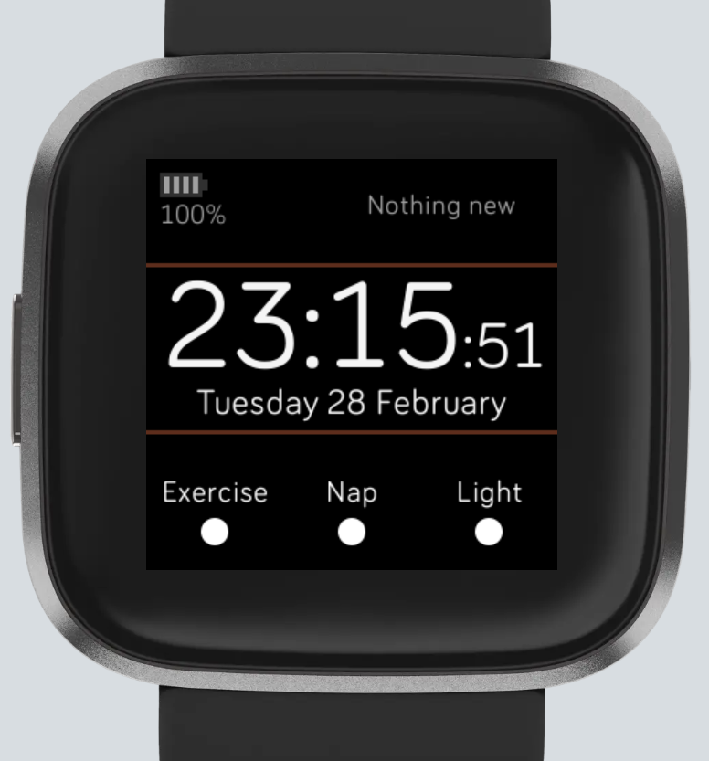

# Poppy_Fitbit

## Overview
Fitbit (smartwatch) applications as a part of an assistive robotic system, which:
1. measures and communicates biometric data to the robot
2. allows remote control of the system
3. monitors activity progress and sends reminder to the user.

Fitbit Device: Versa 2

Fitbit SDK Version: 4.2

## Firebase Server
A intermediate server/database is needed to facilitate the communication between Fitbit and the robot system.  
1. Set up and deploy a firebase server with database and functions.
2. Use npm to install express and other JavaScript packages.

You can use firebase/index.js as a reference.

## How to Run Each Fitbit App/Clockface
Make sure that you have Node.js v14 installed.

There are 4 projects: exercise, light therapy, nap, and clockface.
1. Open each project folder in Visual Studio Code.
2. In package.json, add `"@fitbit/sdk-cli": "^1.7.3"` to `"devDependencies"`
   ```
   "devDependencies": {
    "@fitbit/sdk": "~4.3.0",
    "@fitbit/sdk-cli": "^1.7.3"
  }
  ```
4. Pull up the terminal in VS Code (View > Terminal).
5. Make sure that your Fitbit and your companion app both have developer mode on. In the terminal
   ```
   npm install
   npx fitbit
   fitbit$ install
   fitbit$ build
   ```

Make sure your Fitbit is connected to the phone app via bluetooth.

## Exercise App
It can:
- Send commands to a server if a button is clicked. This is for remote control.
- Send heartrate to a server.
- Check internet and bluetooth connection. 
- Send feedback to a server.





## Nap App or Light Therapy App
It can:
- Set a timer with silent alarm.
- Send time information to a server.
- Send activity status (Done = true) to a server.
- Check internet and bluetooth connection. 
- Send feedback to a server.





## Clockface
Thanks to [mxxshao's repo](https://github.com/mxsshao/versa-clockface) for the template.

It can:
- Read activiy status from a server regularly.
- Remind user of an activity with text and vibration.


